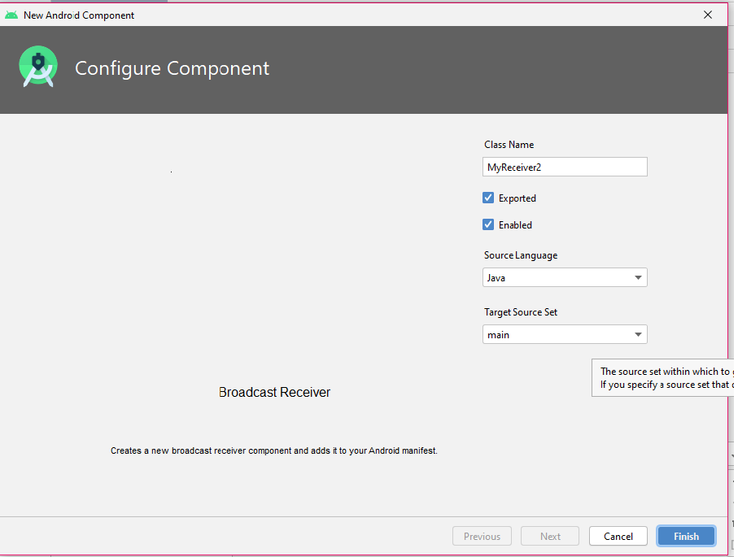

### ĐỐI TƯỢNG INTENT TRONG ANDROID (Phần 3)

- <a href= "https://ngocminhtran.com/2018/11/05/doi-tuong-intent-trong-android-phan-3/"> Ứng Dụng Từ Bài</a>

### Yêu Cầu
A. MÔ TẢ VỀ Android Studio:

### Broadcast Intent
- Một dạng khác của Intent, gọi là Broadcast Intent, là một hệ thống Intent được gởi đến tất cả các ứng dụng đã đăng ký Broadcast Receiver. Ví dụ, hệ thống Android sẽ gởi các Broadcast Intent để xác định sự thay đổi trạng thái của thiết bị như khởi động, kết nối nguồn, bật/tắt màn hình, v.v.
- Các đối tượng broadcast intent gửi các thông điệp bằng cách dùng các phương thức sendBroadcast(), sendStickyBroadcast(), hay sendOrderedBroadcast() của lớp Activity. Khi một broadcast intent được tạo, nó phải chứa một chuỗi xác định sự kiện broadcast còn gọi là action string. Chuỗi này là duy nhất và dùng cú pháp giống tên gói của ứng dụng. Phương thức thiết lập action string cho intent là setAction() như đoạn mã minh họa

### Broadcast Receiver
- Broadcasd Receiver là cơ chế cho phép một ứng dụng có thể hồi đáp đến Broadcast Intent. Trước đó, ứng dụng phải được đăng ký đến bộ lọc Intent (Intent Filter) kiểu IntentFilter. Đoạn mã sau minh họa broadcast receiver:

### Ứng dụng sử dụng Broadcast Intent và Broadcast Receiver
- Tạo ứng dụng
- Tạo một ứng dụng mới tên SendBroadcast, nhập ngocminhtran.com trong Company Domain, chọn Phone and Tablet và API 14, chọn Empty Activity và nhập tên SendBroadcastActivity trong Activity Name và activity_send_broadcast tương ứng trong Layout Name.
- Mở tập tin activity_send_broadcast.xml trong chế độ Design, xóa TextView “Hello World!” mặc định, thêm một Button với giá trị thuộc tính ID và Text lần lượt

### Tạo và gửi Broadcast Intent
- Mở tập tin SendBroadcastActivity.java và thêm phương thức sendBroadcastIntent() đến lớp SendBroadcastActivity để tạo và gửi một đối tượng broadcast intent

### Tạo một Broadcast Receiver
- Để tạo một broadcast receiver, chúng ta cần tạo một lớp mới là con của lớp BroadcastReceiver theo các bước sau:

- Trong thư mục app > java tìm đến nhấn chuột phải vào tên gói trong thư mục này chọn New > Other > Broadcast Receiver:

- Chấp nhận mặc định tên lớp là MyReceiver (trong Class Name) và các tùy chọn khác

### Đăng ký Broadcast Receiver
- Chúng ta sẽ đăng ký broadcast intent đến lớp broadcast receiver này thông qua đối tượng IntentFilter bằng cách mở tập tin SendBroadcastActivity.java và thêm một biến kiểu BroadcastReceiver và phương thức configureReceiver()

### Xử lý khi nguồn bị ngắt kết nối

- Chạy ứng dụng và nhấn nút SEND BROADCAST sẽ hiện thông điệp như sau:

### Lời kết
- Trong bài này chúng ta đã tìm hiểu cách tạo và gửi đối tượng broadcast intent bằng cách đăng ký đến đối tượng broadcast receiver thông qua đối tượng lọc IntentFilter. Mã nguồn hoàn chỉnh các tập tin của ứng dụng SendBroadcast

### Chúc Các Bạn Thành Công !!!

### Bạn Có Thể Xem Bài Tiếp Theo:

- <a href="https://github.com/ChanhMinions/SQLite">Lập trình cơ sở dữ liệu trong Android (Phần 1)!</a>

                                                               Trần Phú , Ngày 23 tháng 7 Năm 2020
